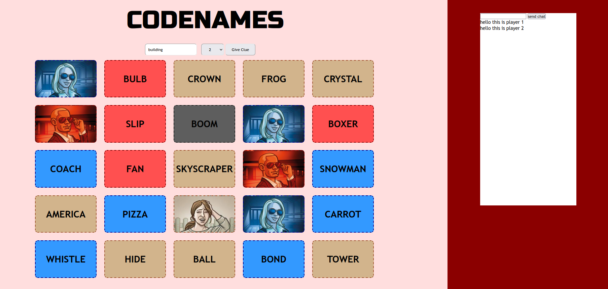

# Team 18 Codenames Project
By: Alexandru Stoica, Daniel Robinson, Hongjia Xue, Shahil Pramodkumar, Ing Sam Yin, Ao Li, Tianxiang Song. 
## Client Server Proof-of-concept
Part of our prototype demonstrates the client-server functionality where one client's action will be sent to the server, modified and then returned to all other clients. We have done this with a Vanilla JavaScript client and a Python Socket-IO server.

### Instructions
1. Write the following command `python3 app.py` in the terminal to load the server. 
1. Load `index.html` into a browser of your choice.
1. Repeat the previous step in another browser window.
1. Join the game in both windows. On one window join the spy team on the top left of the screen. The other window will remain in spymaster view.

From here you can do any of the following:
* Enter a message in the chatbox.
* Enter a clue and number.
* Pick a card to reveal.

The important concept demonstrated in the above actions is that one client (the window where the action took place) will send data to the server which will then send it back to the other client (the other window). This proves that our implementation of multiple players will work sufficiently.

To see the raw data sent between the client and the server, open the console window in the browser and view the printed messages.

### AI Proof-of-concept
The concept and algorithms of codenames AI is available in **Class Descriptions** file, we have made a simple script for the following functionalities:
- one AI in each team, the AI could be either spy or spymaster
- two AIs (one spy and one spymaster) in one team, one AI (could be either) in another team
- two AIs in each team

These screen recordings demonstrate how it works. Link to directory:
[recordings](./rsc/recordings/)

To run the program for yourself follow these steps:
1. Run `sh AIDev/get_glove.sh` from the project root directory. This downloads the wordset.
1. Run `python3 AIDev/codenames.py`.

## Dependencies
* python3
* socketio
* pip
* numba
* numpy
